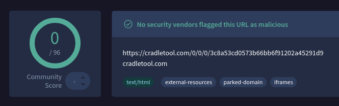
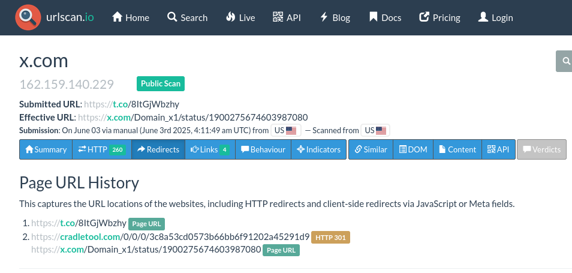
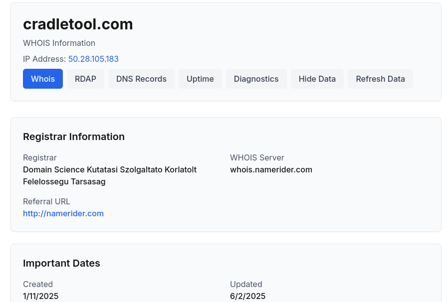

# Phishing Email Analysis – Report 001

> ⚠️ **Security Warning:**  
> This analysis contains links and information from a real phishing email.  
> **Do not click any links** or attempt to visit any domains mentioned unless you're in a secure, sandboxed, or virtual environment.  
> All analysis is for educational and professional portfolio purposes only.

## 🧾 Email Summary

- **From:** HULU MEMBERSHIP <noreply@membershiphulu.com>
- **Subject:** YOUR HULU TV MEMBERSHIP HAS EXPIRED! EXTEND YOUR MEMBERSHIP FOR FREE
- **Return-Path:** bounce@bigsbie.com
- **Date:** Nov 10, 2023

## 🛠 Header Analysis

| Field           | Result                                                 |
| --------------- | ------------------------------------------------------ |
| SPF             | ❌ None                                                |
| DKIM            | ❌ None                                                |
| DMARC           | ❌ permerror                                           |
| Origin IP       | `89.144.12.8` (residential ISP)                        |
| Domain Mismatch | Return-path & From domain do not match legitimate Hulu |

## 🔗 Link Analysis

- **Initial Link:** `https://t.co/8ItGjWbzhy`
- **Redirect Chain:**
  - → `https://cradletool.com/0/0/0/3c8a53cd0573b66bb6f91202a45291d9`
  - → `https://x.com/Domain_x1/status/1900275674603987080` (Twitter impersonation)

### 🔬 VirusTotal Results:

- **Domain:** `cradletool.com`
- **Detection Status:** ✅ No vendors flagged as malicious
- **Community Score:** -1 (Neutral)
- **Additional Notes:**
  - No AV detections, but domain is suspicious based on behavior.
  - Static scan showed no immediate payloads or malicious files.

### 🌐 WHOIS Info:

- **Domain:** `cradletool.com`
- **Registrar:** NameCheap, Inc.
- **Registration Date:** March 22, 2024
- **Country:** Iceland
- **Analysis:** Newly registered domain, minimal web presence, hosted on shared hosting. Common indicators for disposable phishing infrastructure.

## 📸 Screenshots

### Email Displayed in Thunderbird

### VirusTotal Scan

### URLScan Redirect Chain

### Symantec Scan

### WHOIS Lookup

## 🛡 SOC Detection

A SOC might detect this via:

- Email gateway alerts for failed SPF/DKIM
- Domain reputation filtering
- User-reported phishing via Outlook plugin

## 🚨 Response

- Quarantine or delete email
- Block IP `89.144.12.8` and domain `cradletool.com`
- Search logs for user clicks or compromised accounts

## 🧾 IOCs

- IP: `89.144.12.8`
- Domain: `bigsbie.com`, `membershiphulu.com`, `cradletool.com`
- URL: `https://t.co/8ItGjWbzhy`

---

This sample analysis demonstrates knowledge of:

- Email header forensics
- Link analysis
- Basic threat response in a SOC context

_Author: Arthur Vannakittikun_  
_Date: June 3, 2025_
